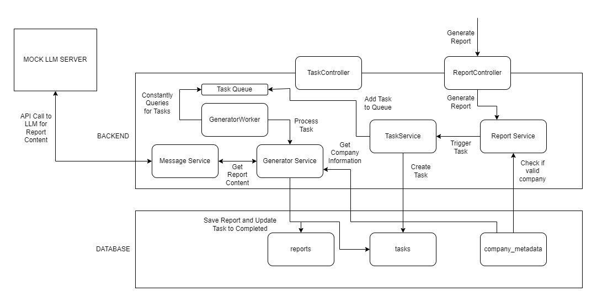

# LLM Credit Score API
This was an API for the Asian Institute of Digital Finance Backend Technical Interview.
It's primary function is to generate a credit rating report using an LLM and display the results. For this impelemntation,
we are just simulating an API call to the LLM by running a mock server that returns a dummy report.
The generation of a report is initiated through the `api/report/generate` endpoint. This will return a task that can be monitored
through the `api/task/get` endpoint. Once the task has a status of "Done", we can query the report associated with this task through
the `api/report/get` endpoint.

# Running the Program
### System Requirements:
- [.NET SDK](https://dotnet.microsoft.com/en-us/download/visual-studio-sdks) = Version 8.0.400
- [Python](https://www.python.org/downloads/) = Version 3.12.6

### Windows
Run the *run.bat* script located in the base directory. 

### Linux and Mac
Run the *run.sh* script located in the base directory. 

# Endpoints

### Report Endpoint
<table>
  <tr>
    <th>Endpoint</th>
    <th>HTTP Method</th>
    <th>Description</th>
    <th colSpan="2">Request</th>
    <th colSpan="2">Response</th>
  </tr>
  <tr>
    <td rowSpan="3">api/report/get</td>
    <td rowSpan="3">GET</td>
    <td rowSpan="3">Retrieve a list of reports</td>
    <tr>
      <td>pageSize</td>
      <td>int; Size of query page</td>
      <td>reports</td>
      <td>Report array; List of retrieved reports</td>
    </tr>
    <tr>
      <td>pageNum</td>
      <td>int; Page number of query</td>
      <td>error</td>
      <td>string; Error encountered in endpoint</td>
    </tr>
  </tr>
  <tr>
    <td rowSpan="3">api/report/get/{id}</td>
    <td rowSpan="3">GET</td>
    <td rowSpan="3">Retrieve a specific report</td>
    <td rowSpan="3">id</td>
    <td rowSpan="3">int; ID of Report to query</td>
    <tr>
      <td>reports</td>
      <td>Report array; Report with specified id</td>
    </tr>
    <tr>
      <td>error</td>
      <td>string; Error encountered in endpoint</td>
    </tr>
  </tr>
  <tr>
    <td rowSpan="4">api/report/generate</td>
    <td rowSpan="4">POST</td>
    <td rowSpan="4">Generate report for a specified company</td>
    <td rowSpan="4">companyId</td>
    <td rowSpan="4">int; ID of Company to generate report for</td>
    <tr>
      <td>task</td>
      <td>Task; Created generate report task</td>
    </tr>
    <tr>
      <td>company</td>
      <td>Company; Associated Company for generate report task</td>
    </tr>
    <tr>
      <td>error</td>
      <td>string; Error encountered in endpoint</td>
    </tr>
  </tr>
</table>

### Task Endpoint
<table>
  <tr>
    <th>Endpoint</th>
    <th>HTTP Method</th>
    <th>Description</th>
    <th colSpan="2">Request</th>
    <th colSpan="2">Response</th>
  </tr>
  <tr>
    <td rowSpan="3">api/task/get</td>
    <td rowSpan="3">GET</td>
    <td rowSpan="3">Retrieve a list of tasks</td>
    <tr>
      <td>pageSize</td>
      <td>int; Size of query page</td>
      <td>tasks</td>
      <td>Task array; List of retrieved tasks</td>
    </tr>
    <tr>
      <td>pageNum</td>
      <td>int; Page number of query</td>
      <td>error</td>
      <td>string; Error encountered in endpoint</td>
    </tr>
  </tr>
  <tr>
    <td rowSpan="3">api/task/get/{id}</td>
    <td rowSpan="3">GET</td>
    <td rowSpan="3">Retrieve a specific task</td>
    <td rowSpan="3">id</td>
    <td rowSpan="3">int; ID of Task to query</td>
    <tr>
      <td>tasks</td>
      <td>Task array; Task with specified id</td>
    </tr>
    <tr>
      <td>error</td>
      <td>string; Error encountered in endpoint</td>
    </tr>
  </tr>
</table>

### Report Object
<table>
  <tr>
    <th>Property</th>
    <th>Description</th>
  </tr>
  <tr>
    <td>reportId</td>
    <td>int; ID of Report</td>
  </tr>
  <tr>
    <td>createDate</td>
    <td>string; Date Created</td>
  </tr>
  <tr>
    <td>content</td>
    <td>string; Content of Report</td>
  </tr>
  <tr>
    <td>taskId</td>
    <td>int; ID of associated Task</td>
  </tr>
  <tr>
    <td>task</td>
    <td>Task; Object of associated Task</td>
  </tr>
  <tr>
    <td>companyId</td>
    <td>int; ID of associated Company</td>
  </tr>
  <tr>
    <td>company</td>
    <td>Company; Object of associated Company</td>
  </tr>
</table>

### Task Object
<table>
  <tr>
    <th>Property</th>
    <th>Description</th>
  </tr>
  <tr>
    <td>taskId</td>
    <td>int; ID of Task</td>
  </tr>
  <tr>
    <td>taskKey</td>
    <td>string; Unique key identifying type of task</td>
  </tr>
  <tr>
    <td>status</td>
    <td>string; Status of Task</td>
  </tr>
  <tr>
    <td>message</td>
    <td>string; Message from Task</td>
  </tr>
  <tr>
    <td>createDate</td>
    <td>string; Date Created</td>
  </tr>
  <tr>
    <td>companyId</td>
    <td>int; ID of Company for generate report task</td>
  </tr>
  <tr>
    <td>task</td>
    <td>Task; Object of associated Task</td>
  </tr>
  <tr>
    <td>company</td>
    <td>Company; Object of associated Company</td>
  </tr>
  <tr>
    <td>reportId</td>
    <td>int?; ID of associated Report, nullable</td>
  </tr>
  <tr>
    <td>report</td>
    <td>Report?; Object of associated Report, nullable</td>
  </tr>
</table>

# Architecture

Below is a diagram showing the process for generating a report.


The process is triggered through the generate report endpoint in the ReportController. This request is processed by the ReportService that first checks if the company we are generating a report for is valid. If it passes the validation, it calls TaskService to create a new Generate Report Task and adds that task to a queue. A background service, GeneratorWorker, is watching the queue waiting for new tasks to be processed. Once it retrieves a task from the queue, it sends it to GeneratorService to be processed. It first queries the company information and uses this to build a prompt for the LLM. We then send this prompt to the MessageService which makes an API call to the LLM via http. For our prototype, we are just calling a mock LLM server that returns a dummy response. Once we ge this response, MessageService then returns this to the GeneratorService. This service, in turn, would save the report to the database and update our task status to be completed.

There is an endpoint to retrieve tasks in the TaskController which simply retrieves the tasks from our database. This is mainly used to check if our generate report task has been completed. This could be converted to a WebSocket to remove the need for recurring calls. Lastly, there is also an endpoint in the ReportController to retrieve the generated reports. The id identifying the report could be found in the task that generated that report.

# File Structure

### llm-credit-score-api
.NET Project for running web API and for background services. 
```
├───Program.cs
├───GeneratorWorker.cs
├───BackgroundServices
│   └───Interfaces
│       GeneratorService.cs
│       MessageService.cs
└───Controllers
        ReportController.cs
        TaskController.cs
```
Program.cs - starting point of application. Where we register all the services we will use.

GeneratorWorker.cs - Background task that handles watching queue for new generate report tasks.

BackgroundServices/GeneratorService.cs - Handles logic for generating report. Queries necessary data from DB, builds prompt and saves generated report to DB.

BackgroundServices/MessageService.cs - Handles sending HTTP calls. Mainly used to get LLM response from generated prompt.

Controllers/ReportController.cs - Entrypoint of API for the endpoints beginning with `api/report`

Controllers/TaskController.cs - Entrypoint of API for the endpoints beginning with `api/task`

### llm-credit-score-api-application
.NET Project for main business logic.
```
├───Constants
│       LLMConstants.cs
│       TaskKey.cs
│       TaskStat.cs
├───Data
│   │   AppDbContext.cs
│   ├───Interfaces
│   ├───json
│   └───sql
│           db.db
├───Messages
├───Models
│       AppTask.cs
│       Company.cs
│       FinancialRatio.cs
│       Report.cs
├───Repositories
│   │   ReportRepository.cs
│   │   Repository.cs
│   │   TaskRepository.cs
│   │   UnitOfWork.cs
│   └───Interfaces
└───Services
    │   ReportService.cs
    │   TaskService.cs
    └───Interfaces
```
Constants/LLMConstants.cs - Constants used for interacting wtih the LLM.

Constants/TaskKey.cs - Supported background task keys.

Constants/TaskStat.cs - Supported task status.

Data/AppDbContext.cs - EF Core Context that handles defining our Database structure.

Data/json/ - folder containing given json data.

Data/sql/ - folder containing SQL Scripts used for populating the Database.

Data/sq/db.db - SQLite Database used by application.

Messages/ - folder containing request and response models of API.

Models/AppTask.cs - Model for Task object. Maps to tasks SQL table.

Models/Report.cs - Model for Report object. Maps to reports SQL table.

Models/Company.cs - Model for Company object. Maps to company_metadata SQL table.

Models/FinancialRatio.cs - Model for FinancialRatio object. Maps to company_financial_ratios SQL table.

Repositories/Repository.cs - Handles EF Core logic for querying to Database.

Repositories/ReportRepository.cs - Custom Repository for Report objects.

Repositories/TaskRepository.cs - Custom Repository for Task objects.

Repositories/UnitOfWork.cs - Encapsulates Repositories and Database transactions.

Services/ReportService.cs - Service that handles logic for API calls for Report objects. Linked to ReportController.cs.

Services/TaskService.cs - Service that handles logic for API calls for Task objects. Linked to TaskController.cs.

### mock-llm-server
Simple HTTP server in Python to mock API call to LLM.

```
    credit_report.txt
    main.py
```

main.py - Creates and runs HTTP server

credit_report.txt - Simulated credit report output of LLM

### llm-credit-score-api-application-tests
Project containing unit tests for llm-credit-score-api-application
